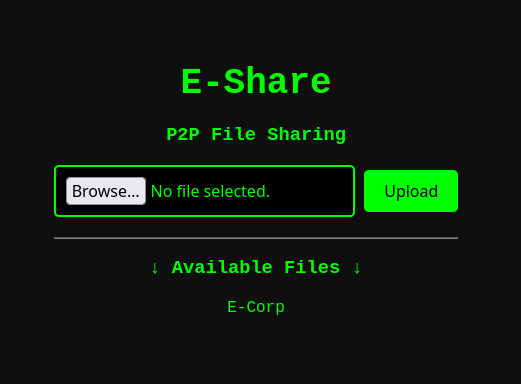

***E-Share*** is a peer-to-peer file sharing web application built using Flask. This project allows users to effortlessly upload, download, and stream files directly through their browser.

📂 **Features:**

-   **Upload Files**: Easily upload files of any type.
-   **Download Files**: Download shared files with just a click.
-   **Stream Files**: Stream media files directly from the server.
-   **File Listing**: View a list of all uploaded files.

🌐 **Tech Stack:**

-   **Flask**: Python microframework for web development.
-   **HTML/CSS**: Frontend for a seamless user experience.
-   **Python**: Backend scripting for file management.

🤝 **Contributing:**

Contributions are welcome! Feel free to fork and submit pull requests.
